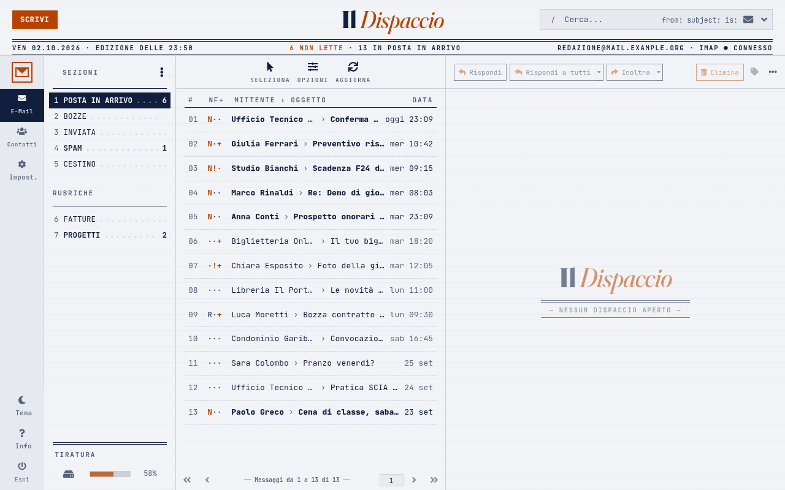
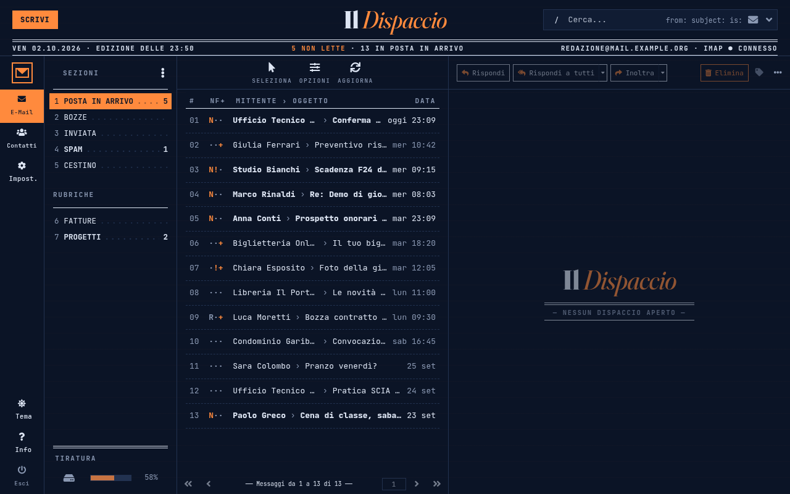
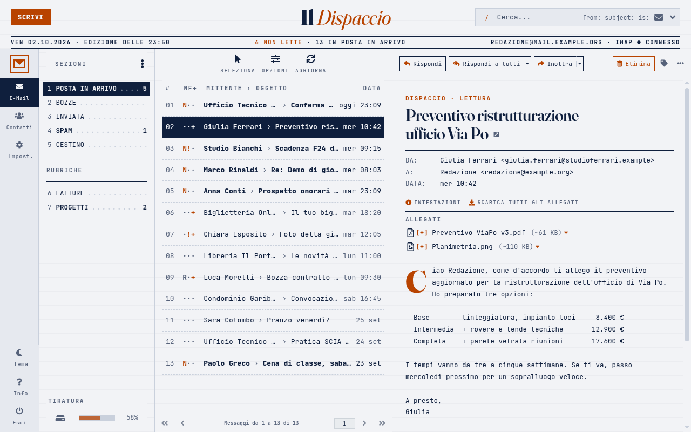
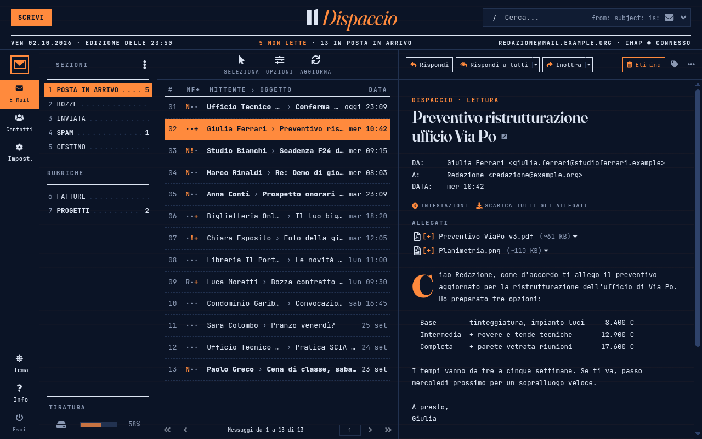
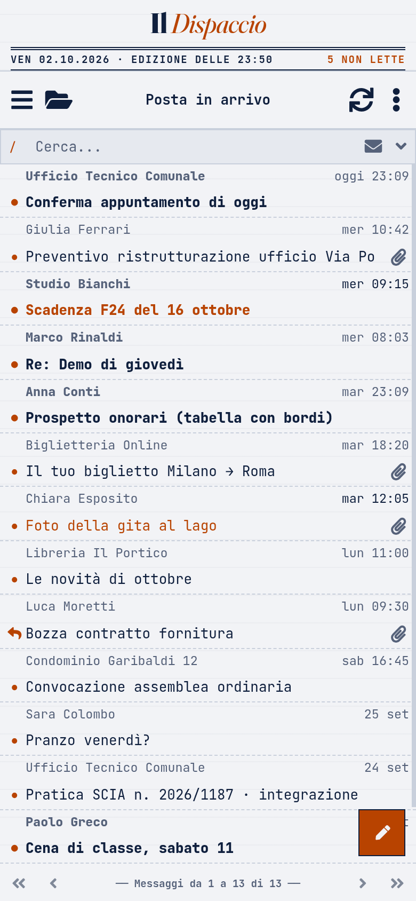
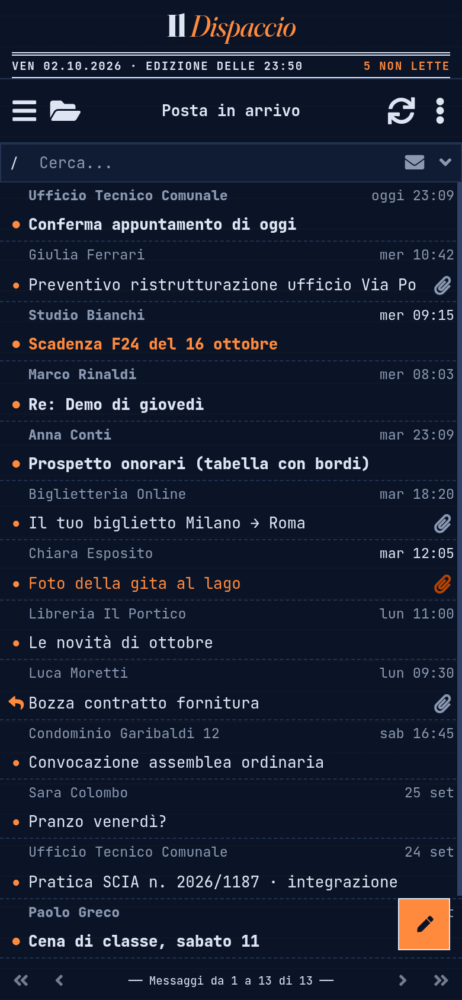

# Il Dispaccio — skin per Roundcube

**Il Dispaccio** è una skin per [Roundcube Webmail](https://roundcube.net) dallo stile tipografico ed editoriale,
a metà tra telegrafo e gazzetta. Usa JetBrains Mono ovunque e Fraunces per la testata e i titoli. La selezione è
un blocco pieno invertito, le cartelle sono numerate con puntini di guida e le sezioni sono separate da doppi filetti.
Funziona in tema chiaro e scuro.

È una *child skin* di **Elastic** (la skin predefinita di Roundcube): ne eredita tutto il funzionamento e
sostituisce colori, caratteri e un solo template.

*English version below.*

| Chiaro | Scuro |
|---|---|
|  |  |
|  |  |

<p>


</p>

## Requisiti

* **Roundcube 1.7.x** (testata con la **1.7.4**). La skin **Elastic** deve restare installata (è inclusa in Roundcube).
* Un browser recente con supporto a `:has()`: Chrome/Edge ≥ 105, Firefox ≥ 121, Safari ≥ 15.4.
* Nessuna risorsa esterna: i font sono inclusi (woff2) e non si caricano CDN o Google Fonts.

## Contenuto del repository

| Percorso | Cosa |
|---|---|
| `dispaccio/` | La skin, da copiare in `<roundcube>/skins/` (CSS già compilato incluso) |
| `plugins/startup_folder/` | Plugin **facoltativo**: ogni utente sceglie la cartella da aprire all'accesso |
| `config/dispaccio.config.php.example` | Impostazioni consigliate (date, skin predefinita, plugin) |
| `screenshots/` | Immagini per questo README (dati di esempio fittizi) |

## Installazione

1. **Scarica** l'ultima release (`dispaccio.zip`) dalla pagina [Releases](../../releases), oppure clona il repository:
   ```sh
   git clone https://github.com/enrimagna/roundcube-skin-dispaccio.git
   ```
2. **Copia la cartella** `dispaccio/` dentro `<roundcube>/skins/`. Il risultato deve essere `skins/dispaccio/meta.json`,
   accanto a `skins/elastic/`. Il server web deve poter leggere i file.
3. **Attiva la skin** in uno di questi due modi:
   * come predefinita per tutti, in `config/config.inc.php`:
     ```php
     $config['skin'] = 'dispaccio';
     ```
     Se usi `skins_allowed`, aggiungi `'dispaccio'` all'elenco.
   * oppure lascia scegliere agli utenti da **Impostazioni → Preferenze → Interfaccia utente → Tema interfaccia**.
4. **Date consigliate** (nell'elenco le date più vecchie di una settimana diventano «23 set», con l'anno solo per la posta
   degli anni precedenti, «8 mar 2025»; nell'intestazione del messaggio aperto la data è sempre completa, «8 mar 2026, 14:32»).
   Aggiungi in `config/config.inc.php`:
   ```php
   $config['prettydate'] = true;          // oggi: ora; ultimi 7 giorni: giorno + ora
   $config['date_long']  = 'j M Y, H:i';  // data completa; nell'elenco la skin toglie ora e anno corrente
   $config['dont_override'] = array_merge($config['dont_override'] ?? [], ['date_long']);
   ```
   La riga `dont_override` è **necessaria**. Senza, la prima volta che un utente salva *Preferenze → Interfaccia utente*
   (anche solo per cambiare skin), Roundcube memorizza nelle sue preferenze un formato tipo `Y-m-d H:i` e le date
   tornano «2026-09-25 13:10». Il compromesso è che gli utenti non possono cambiare il formato delle date vecchie
   nell'elenco. I menu data/ora continuano a valere per gli orari di oggi, i selettori di data e la rubrica.
5. **Plugin facoltativo `startup_folder`** (cartella all'apertura):
   * copia `plugins/startup_folder/` in `<roundcube>/plugins/startup_folder/`;
   * aggiungi `$config['plugins'][] = 'startup_folder';` (oppure inseriscilo nell'array `$config['plugins']` esistente);
   * gli utenti trovano l'opzione «Cartella all'apertura» in *Preferenze → Impaginazione messaggi*. Il valore
     predefinito è la Posta in arrivo. Vedi `plugins/startup_folder/README.md`.
6. **Svuota la cache del browser** (o ricarica con Ctrl/Cmd+Shift+R) dopo l'installazione o un aggiornamento.

Non serve compilare nulla: `styles/styles.css` e `styles/styles.min.css` sono già inclusi.

### Docker (immagine ufficiale `roundcube/roundcubemail`)

Monta la skin (ed eventualmente il plugin e la configurazione) nel container:

```sh
docker run -d --name roundcube -p 8000:80 \
  -e ROUNDCUBEMAIL_DEFAULT_HOST=ssl://imap.example.org -e ROUNDCUBEMAIL_SMTP_SERVER=tls://smtp.example.org \
  -v "$PWD/dispaccio:/var/www/html/skins/dispaccio:ro" \
  -v "$PWD/plugins/startup_folder:/var/www/html/plugins/startup_folder:ro" \
  -v "$PWD/config/dispaccio.config.php.example:/var/roundcube/config/dispaccio.config.php:ro" \
  roundcube/roundcubemail:1.7.4-apache
```

* L'immagine carica i file `/var/roundcube/config/*.php` **all'avvio del container**. Un file *nuovo* aggiunto lì
  richiede quindi un riavvio. Le modifiche a un file già presente valgono subito.
* Per attivare il plugin puoi anche usare la variabile `ROUNDCUBEMAIL_PLUGINS=archive,zipdownload,startup_folder`.

### Modificare il LESS e ricompilare il CSS

Serve solo se modifichi `styles/*.less`. Il LESS importa i sorgenti di Elastic da `../../elastic/styles/`, quindi
va compilato dentro un'installazione di Roundcube (`skins/elastic` accanto a `skins/dispaccio`):

```sh
cd <roundcube>/skins/dispaccio
npm install --no-save less@4 less-plugin-clean-css
npx lessc --rewrite-urls=all styles/styles.less > styles/styles.css
npx lessc --rewrite-urls=all --clean-css="--s1 --advanced" styles/styles.less > styles/styles.min.css
```

## Limiti noti

* Alcune etichette sono testo fisso italiano nel CSS («Sezioni», «Rubriche», «Tiratura», «Da/A/Data», l'intestazione
  delle colonne). Le abbreviazioni brevi della barra laterale sono in italiano solo con l'interfaccia in italiano.
* Il capolettera si applica solo ai messaggi in testo semplice. Le email HTML restano chiare anche nel tema scuro, per
  scelta: invertire l'HTML dei mittenti rovina loghi e colori.
* Tra 1025 e 1200 px di larghezza mittente e oggetto vengono accorciati parecchio.
* Su smartphone il testo semplice con a capo fissi (~70 caratteri) va a capo una seconda volta.
* «imap ● connesso» nella riga della data è decorativo: non controlla davvero la connessione.
* Data completa nell'intestazione e anno nell'elenco solo con `date_long = 'j M Y, H:i'` (punto 4). Con il vecchio
  `'j M'` (consigliato fino alla 1.0.0) la skin funziona ma l'anno non compare né nell'elenco né nell'intestazione.
  L'accorciamento nell'elenco è fatto in JavaScript dal template `layout.html`.
* Il template `templates/includes/layout.html` è una copia modificata di quello di Elastic. Dopo un aggiornamento di
  Roundcube conviene confrontarlo con `skins/elastic/templates/includes/layout.html`. L'unica aggiunta è il blocco
  `Il Dispaccio: masthead` (più il piccolo script `Il Dispaccio: dates`).

## Risoluzione dei problemi

* **La skin non compare tra le scelte:** controlla il percorso (`skins/dispaccio/meta.json`), i permessi di lettura e
  `skins_allowed`. Elastic deve essere presente.
* **Aspetto «a metà» o vecchio dopo un aggiornamento:** svuota la cache del browser. Se usi un proxy o una CDN, svuota
  anche quella.
* **Le date vecchie appaiono come «2026-09-25 13:10»:** manca `dont_override` per `date_long` (punto 4), oppure un
  altro file di configurazione la ridefinisce.
* **Icone mancanti o quadratini:** di solito capita compilando il LESS senza `--rewrite-urls=all`. Usa il CSS incluso
  oppure ricompila come indicato sopra.
* **Il plugin non appare in Preferenze:** controlla che il nome della cartella sia esattamente `startup_folder` e che
  sia presente in `$config['plugins']`. Nei log di Roundcube (`logs/errors.log`) trovi eventuali errori.

## Crediti e licenza

* Basata su **Elastic** di Roundcube (© The Roundcube Dev Team, design di Aleksander Machniak), licenza CC BY-SA 3.0.
* **JetBrains Mono** (© The JetBrains Mono Project Authors) e **Fraunces** (© The Fraunces Project Authors), SIL OFL 1.1.
  Le licenze sono in `dispaccio/fonts/`.
* La skin (`dispaccio/`) è distribuita con licenza **CC BY-SA 3.0**, come Elastic da cui deriva. Il plugin
  `startup_folder` è distribuito con licenza **GPL-3.0-or-later**. Dettagli in [`LICENSE`](LICENSE).

---

## English

**Il Dispaccio** is a typographic, editorial skin for Roundcube Webmail ("telegraph × gazette"). It uses JetBrains Mono
throughout and Fraunces for the masthead and headlines. Selections are inverted solid blocks, folders are numbered
with dot leaders, and rules are doubled. It supports light and dark mode. It is a child skin of **Elastic**: it overrides
colours, fonts and a single template (`templates/includes/layout.html`, which adds the masthead).

**Requirements:** Roundcube 1.7.x (tested with 1.7.4), with Elastic installed. A browser that supports `:has()`
(Chrome/Edge 105+, Firefox 121+, Safari 15.4+). No external requests (fonts are bundled).

**Install**

1. Download `dispaccio.zip` from [Releases](../../releases), or clone this repository.
2. Copy `dispaccio/` into `<roundcube>/skins/`, so you get `skins/dispaccio/meta.json` next to `skins/elastic/`.
3. Set `$config['skin'] = 'dispaccio';` in `config/config.inc.php`, or let users pick it in Settings → Preferences →
   User Interface.
4. Recommended date settings (list: older mail shown as «23 set», with the year only for mail from previous years,
   «8 mar 2025»; opened message header: always the full date, «8 mar 2026, 14:32»):
   ```php
   $config['prettydate'] = true;
   $config['date_long']  = 'j M Y, H:i';   // the skin drops the time and the current year in the list
   $config['dont_override'] = array_merge($config['dont_override'] ?? [], ['date_long']);
   ```
   The `dont_override` line is required. Otherwise Roundcube stores `"<date format> <time format>"` in a user's
   preferences the first time they save the User Interface page, and «23 set» is lost for that user. Trade-off: users
   can't change the format of older dates in the list.
5. Optional plugin `startup_folder`: copy `plugins/startup_folder/` into `<roundcube>/plugins/` and add
   `$config['plugins'][] = 'startup_folder';`. Users then get a "Startup folder" option in Preferences → Mailbox View
   (default: Inbox).
6. Clear the browser cache (hard reload).

The compiled CSS is shipped, so no build step is needed. To rebuild after editing the LESS, run the `lessc` commands
above inside a Roundcube tree. **Docker:** mount `dispaccio/` at `/var/www/html/skins/dispaccio`, the plugin at
`/var/www/html/plugins/startup_folder`, and the example config at `/var/roundcube/config/dispaccio.config.php`.
The image reads new files in that folder only when the container starts.

**Known limitations** and **troubleshooting**: see the Italian sections above, and `dispaccio/README.md`
(English, with technical details).

**Licence:** the skin is CC BY-SA 3.0 (it is an adaptation of Roundcube's Elastic skin, © The Roundcube Dev Team).
The `startup_folder` plugin is GPL-3.0-or-later. The fonts are SIL OFL 1.1. See [`LICENSE`](LICENSE).
